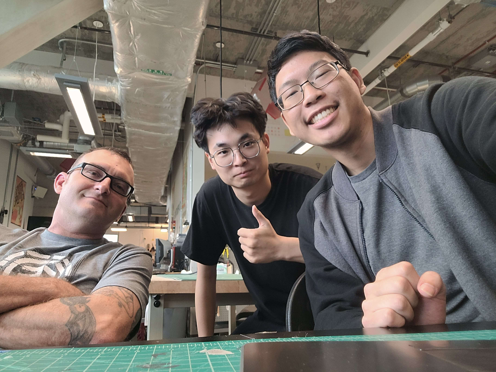

## by Allen Keng, John Mamola, Bran Zhang for ECE 196 Spring 2024 

## Problem: 
* Many snowboarders, particularly beginners, encounter injuries and struggle to identify areas for improvement on their own.

## Our Solution:
* A support system that alerts the user if their movement could lead to falling. It also informs the user on how to improve in real-time with tips about their footing, speed, and general control over the board.  

## Project Overview

- This project aims to create a simple snowboard support system solution for safeguarding beginners. Our solution takes accelerometer input and exchanges data with python through the ESP32 microcontroller and bluetooth.

## Who We Are: Team Old v New
- Allen Keng
- John Mamola
- Bran Zhang

## Our Favorite Images

## Designs and Demos

    
- [PCB Designs](schematics.md)
- [Video Demo]()
- [Design Poster]()

## User Manual / Tutorial:
1. Obtain Product
2. Insert battery
3. Attach to snowboard
4. Go Snowboarding
5. Fall 
6. Read personalized tips
7. Don't fall

## Our Resources: 
* Resource 1
    - Description:  
* Resource 2
    - Description:  
* Resource 3
    - Description:  
* Resource 4
    - Description:  
* Resource 5
    - Description:  

